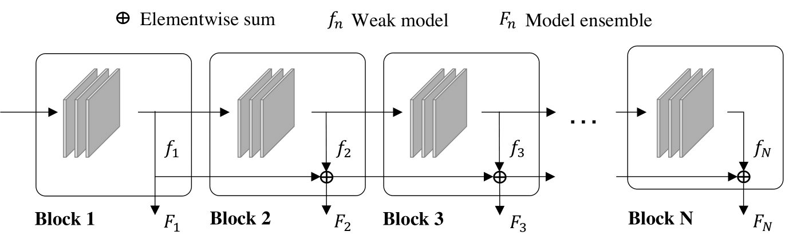
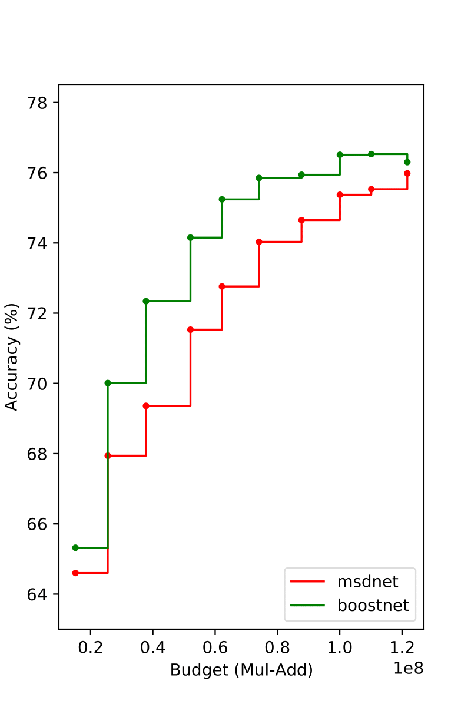
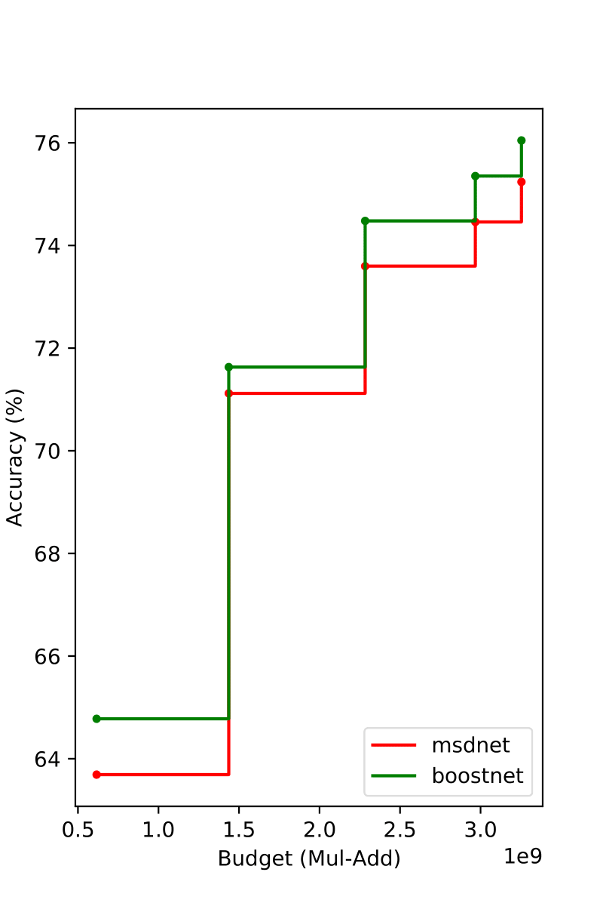
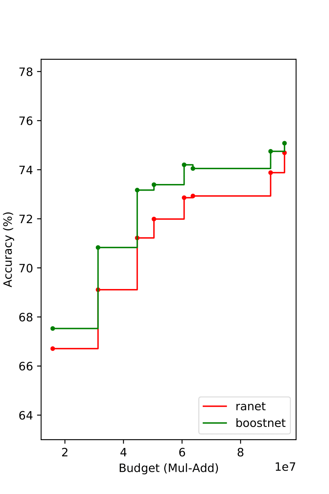
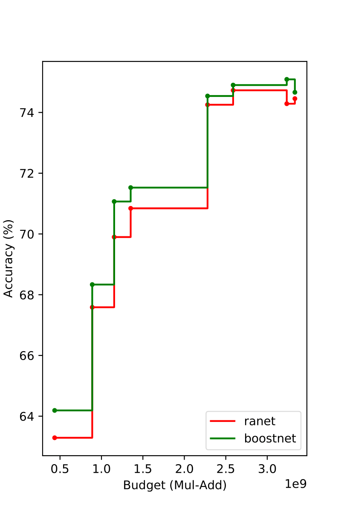
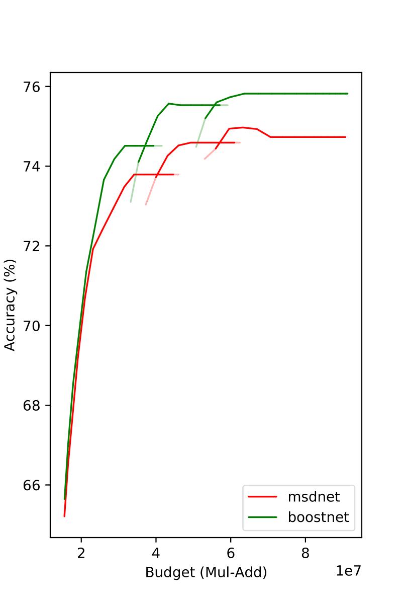
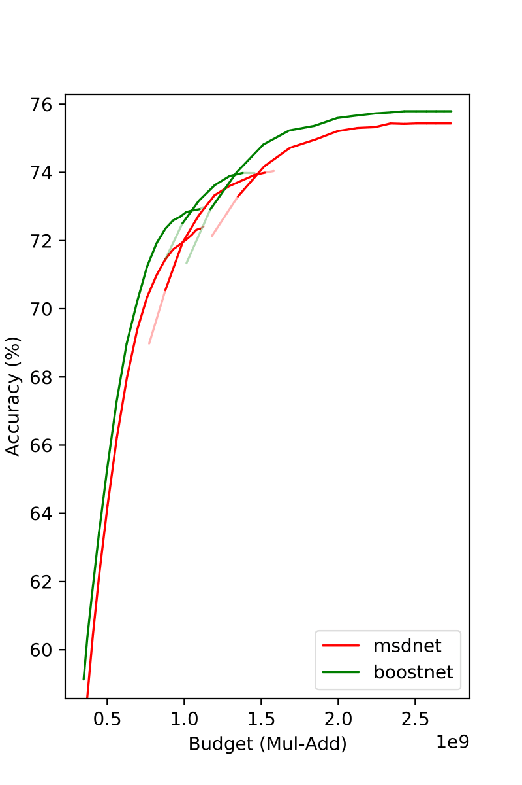
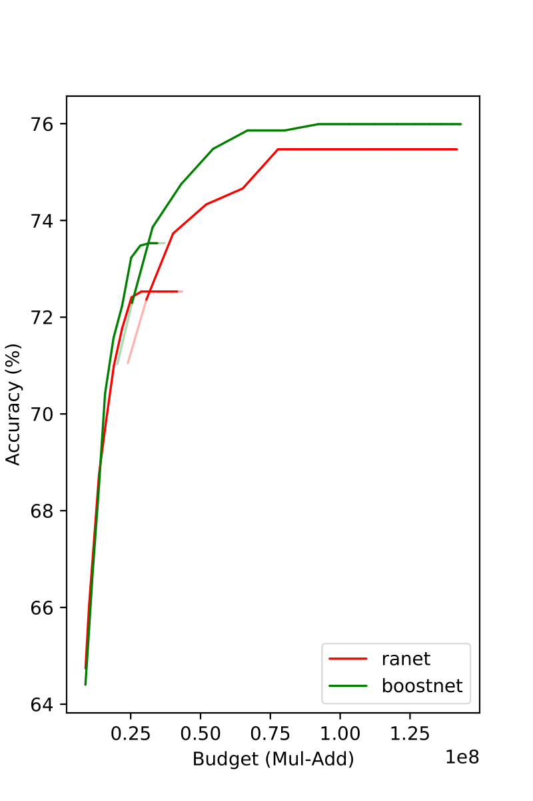
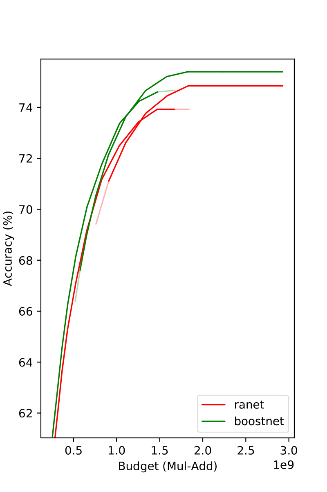

# Boosted-Dynamic-Networks
[Haichao Yu](mailto:haichao.yu@outlook.com), [Haoxiang Li](http://blog.haoxiang.org/haoxiang.html), [Gang Hua](https://www.ganghua.org), [Gao Huang](http://www.gaohuang.net), [Humphrey Shi](https://www.humphreyshi.com)

This repository is the official implementation for our paper [Boosted Dynamic Neural Networks](https://arxiv.org/abs/2211.16726). In the paper, we propose a new early-exiting dynamic neural network (EDNN) architecture, where we formulate an EDNN as an additive model inspired by gradient boosting, and propose multiple training techniques to optimize the model effectively. Our experiments show it achieves superior performance on CIFAR100 and ImageNet datasets in both anytime and budgeted-batch prediction modes.



## Results in Anytime Prediction Mode
| MSDNet on CIFAR100 | MSDNet on ImageNet | RANet on CIFAR100 | RANet on ImageNet |
|:---:|:---:|:---:|:---:|
| []()  | []() | []() | []()|

## Results in Budgeted-batch Prediction Mode
| MSDNet on CIFAR100 | MSDNet on ImageNet | RANet on CIFAR100 | RANet on ImageNet |
|:---:|:---:|:---:|:---:|
| []()  | []() | []() | []()|

## Usage 
Please use the scripts in `msdnet_scripts/` and `ranet_scripts/` for model training and evaluation. For ImageNet experiments, please first download the dataset and put it into the proper folder.

## Citation
```
@article{yu2022boostdnn,
	title        = {Boosted Dynamic Neural Networks},
	author       = {Yu, Haichao and Li, Haoxiang and Hua, Gang and Huang, Gao and Shi, Humphrey},
	year         = 2022,
	url          = {https://arxiv.org/abs/2211.16726},
	eprint       = {2211.16726},
	archiveprefix = {arXiv},
	primaryclass = {cs.LG}
}
```

## Acknowledgments
This repository is built based on previous open-sourced efforts:
* [MSDNet-PyTorch](https://github.com/kalviny/MSDNet-PyTorch)
* [IMTA](https://github.com/kalviny/IMTA)
* [RANet-pytorch](https://github.com/yangle15/RANet-pytorch)
